# Clean & Analyze Social Media
# Introduction

Social media has become a ubiquitous part of modern life, with platforms such as Instagram, Twitter, and Facebook serving as essential communication channels. Social media data sets are vast and complex, making analysis a challenging task for businesses and researchers alike. In this project, we explore a simulated social media, for example Tweets, data set to understand trends in likes across different categories.
The objective of this project is to analyze social media data and gain insights into user engagement. We will explore the data set using visualization techniques to understand the distribution of likes across different categories. Finally, we will analyze the data to draw conclusions about the most popular categories and the overall engagement on the platform.
# Importing required libraries


```python
import pandas as pd
import numpy as np
import matplotlib.pyplot as plt
import seaborn as sns
import random
```

# Generating random data for the social media data


```python
n = 500  
categories = ['Food', 'Travel', 'Fashion', 'Fitness', 'Music', 'Culture', 'Family', 'Health']
data = {
    'User Id': range(1, n + 1),
    'Category': [random.choice(categories) for _ in range(n)],
    'Post Type': [random.choice(['Text', 'Image', 'Video']) for _ in range(n)],
    'Date': pd.date_range('2021-01-01', periods=n),
    'Age': np.random.randint(13, 72, size=n),
    'Gender': np.random.randint(0, 2, size=n),  # 0 for male, 1 for female 
    'Likes': np.random.randint(0, 10000, size=n),
    'Comments': np.random.randint(0, 1000, size=n),
    'Shares': np.random.randint(0, 1000, size=n),
    'Views': np.random.randint(0, 100000, size=n),
    'Engagement': np.random.randint(1, 100, size=n),  # Simulated engagement metric
    'Followers Count': np.random.randint(100, 10000, size=n)  # Simulated followers count
}
```
These random variables were generated to mimic a social media dataset, facilitating analysis and exploration of user behaviors and engagement patterns across various content categories and post types.

# Variables Documentation:

My Random Variables:
1.	User ID: Unique identification number assigned to each user.
2.	Category: Represents the type of content posted, selected randomly from options like Food, Travel, Fashion, etc.
3.	Post Type: Indicates the format of the post (Text, Image, Video).
4.	Date: Timestamp indicating when the post was made, ranging from '2021-01-01' to a period of 'n'.
5.	Age: Randomly generated age of the users, ranging from 13 to 72 years old.
6.	Gender: Binary representation (0 for male, 1 for female) denoting the user's gender.
7.	Likes: Random count of likes received for the post, ranging from 0 to 10,000.
8.	Comments: Random count of comments received on the post, ranging from 0 to 1,000.
9.	Shares: Random count of shares received for the post, ranging from 0 to 1,000.
10.	Views: Random count of views on the post, ranging from 0 to 100,000.
11.	Engagement: Simulated metric representing the level of interaction with the post, ranging from 1 to 100.
12.	Followers Count: Simulated count of followers a user has, ranging from 100 to 10,000.

```python
SM.to_csv('social_media_data.csv', index=False)
```

# Loading and Exploring Data


```python
SM = pd.DataFrame(data)
SM.head(3)
```


<div>
<style scoped>
    .dataframe tbody tr th:only-of-type {
        vertical-align: middle;
    }

    .dataframe tbody tr th {
        vertical-align: top;
    }

    .dataframe thead th {
        text-align: right;
    }
</style>
<table border="1" class="dataframe">
  <thead>
    <tr style="text-align: right;">
      <th></th>
      <th>User Id</th>
      <th>Category</th>
      <th>Post Type</th>
      <th>Date</th>
      <th>Age</th>
      <th>Gender</th>
      <th>Likes</th>
      <th>Comments</th>
      <th>Shares</th>
      <th>Views</th>
      <th>Engagement</th>
      <th>Followers Count</th>
    </tr>
  </thead>
  <tbody>
    <tr>
      <th>0</th>
      <td>1</td>
      <td>Fitness</td>
      <td>Image</td>
      <td>2021-01-01</td>
      <td>13</td>
      <td>1</td>
      <td>8946</td>
      <td>962</td>
      <td>554</td>
      <td>19769</td>
      <td>34</td>
      <td>3166</td>
    </tr>
    <tr>
      <th>1</th>
      <td>2</td>
      <td>Health</td>
      <td>Text</td>
      <td>2021-01-02</td>
      <td>41</td>
      <td>0</td>
      <td>35</td>
      <td>703</td>
      <td>736</td>
      <td>19869</td>
      <td>40</td>
      <td>1983</td>
    </tr>
    <tr>
      <th>2</th>
      <td>3</td>
      <td>Food</td>
      <td>Image</td>
      <td>2021-01-03</td>
      <td>28</td>
      <td>0</td>
      <td>592</td>
      <td>752</td>
      <td>181</td>
      <td>43544</td>
      <td>36</td>
      <td>3040</td>
    </tr>
  </tbody>
</table>
</div>


```python
SM.tail(3)
```


<div>
<style scoped>
    .dataframe tbody tr th:only-of-type {
        vertical-align: middle;
    }

    .dataframe tbody tr th {
        vertical-align: top;
    }

    .dataframe thead th {
        text-align: right;
    }
</style>
<table border="1" class="dataframe">
  <thead>
    <tr style="text-align: right;">
      <th></th>
      <th>User Id</th>
      <th>Category</th>
      <th>Post Type</th>
      <th>Date</th>
      <th>Age</th>
      <th>Gender</th>
      <th>Likes</th>
      <th>Comments</th>
      <th>Shares</th>
      <th>Views</th>
      <th>Engagement</th>
      <th>Followers Count</th>
    </tr>
  </thead>
  <tbody>
    <tr>
      <th>497</th>
      <td>498</td>
      <td>Fashion</td>
      <td>Text</td>
      <td>2022-05-13</td>
      <td>54</td>
      <td>0</td>
      <td>8186</td>
      <td>561</td>
      <td>3</td>
      <td>47506</td>
      <td>7</td>
      <td>480</td>
    </tr>
    <tr>
      <th>498</th>
      <td>499</td>
      <td>Travel</td>
      <td>Video</td>
      <td>2022-05-14</td>
      <td>71</td>
      <td>0</td>
      <td>4418</td>
      <td>984</td>
      <td>501</td>
      <td>17607</td>
      <td>29</td>
      <td>7784</td>
    </tr>
    <tr>
      <th>499</th>
      <td>500</td>
      <td>Food</td>
      <td>Image</td>
      <td>2022-05-15</td>
      <td>36</td>
      <td>0</td>
      <td>7609</td>
      <td>604</td>
      <td>979</td>
      <td>20068</td>
      <td>41</td>
      <td>2935</td>
    </tr>
  </tbody>
</table>
</div>


```python
SM.info()
```

    <class 'pandas.core.frame.DataFrame'>
    RangeIndex: 500 entries, 0 to 499
    Data columns (total 12 columns):
     #   Column           Non-Null Count  Dtype         
    ---  ------           --------------  -----         
     0   User Id          500 non-null    int64         
     1   Category         500 non-null    object        
     2   Post Type        500 non-null    object        
     3   Date             500 non-null    datetime64[ns]
     4   Age              500 non-null    int64         
     5   Gender           500 non-null    int64         
     6   Likes            500 non-null    int64         
     7   Comments         500 non-null    int64         
     8   Shares           500 non-null    int64         
     9   Views            500 non-null    int64         
     10  Engagement       500 non-null    int64         
     11  Followers Count  500 non-null    int64         
    dtypes: datetime64[ns](1), int64(9), object(2)
    memory usage: 47.0+ KB


```python
SM.describe()
```


<div>
<style scoped>
    .dataframe tbody tr th:only-of-type {
        vertical-align: middle;
    }

    .dataframe tbody tr th {
        vertical-align: top;
    }

    .dataframe thead th {
        text-align: right;
    }
</style>
<table border="1" class="dataframe">
  <thead>
    <tr style="text-align: right;">
      <th></th>
      <th>User Id</th>
      <th>Age</th>
      <th>Gender</th>
      <th>Likes</th>
      <th>Comments</th>
      <th>Shares</th>
      <th>Views</th>
      <th>Engagement</th>
      <th>Followers Count</th>
    </tr>
  </thead>
  <tbody>
    <tr>
      <th>count</th>
      <td>500.000000</td>
      <td>500.000000</td>
      <td>500.000000</td>
      <td>500.000000</td>
      <td>500.000000</td>
      <td>500.000000</td>
      <td>500.000000</td>
      <td>500.00000</td>
      <td>500.000000</td>
    </tr>
    <tr>
      <th>mean</th>
      <td>250.500000</td>
      <td>41.512000</td>
      <td>0.466000</td>
      <td>4995.168000</td>
      <td>516.576000</td>
      <td>507.204000</td>
      <td>51557.750000</td>
      <td>51.03600</td>
      <td>5079.326000</td>
    </tr>
    <tr>
      <th>std</th>
      <td>144.481833</td>
      <td>16.549611</td>
      <td>0.499342</td>
      <td>2939.869857</td>
      <td>284.840736</td>
      <td>289.300162</td>
      <td>29315.463786</td>
      <td>28.62981</td>
      <td>2750.672515</td>
    </tr>
    <tr>
      <th>min</th>
      <td>1.000000</td>
      <td>13.000000</td>
      <td>0.000000</td>
      <td>23.000000</td>
      <td>4.000000</td>
      <td>0.000000</td>
      <td>202.000000</td>
      <td>1.00000</td>
      <td>100.000000</td>
    </tr>
    <tr>
      <th>25%</th>
      <td>125.750000</td>
      <td>28.000000</td>
      <td>0.000000</td>
      <td>2420.750000</td>
      <td>276.000000</td>
      <td>257.750000</td>
      <td>26449.000000</td>
      <td>26.75000</td>
      <td>2732.250000</td>
    </tr>
    <tr>
      <th>50%</th>
      <td>250.500000</td>
      <td>41.500000</td>
      <td>0.000000</td>
      <td>5057.500000</td>
      <td>534.000000</td>
      <td>520.500000</td>
      <td>52138.500000</td>
      <td>53.00000</td>
      <td>5105.000000</td>
    </tr>
    <tr>
      <th>75%</th>
      <td>375.250000</td>
      <td>55.000000</td>
      <td>1.000000</td>
      <td>7586.500000</td>
      <td>762.000000</td>
      <td>757.000000</td>
      <td>77361.500000</td>
      <td>76.00000</td>
      <td>7476.000000</td>
    </tr>
    <tr>
      <th>max</th>
      <td>500.000000</td>
      <td>71.000000</td>
      <td>1.000000</td>
      <td>9985.000000</td>
      <td>998.000000</td>
      <td>999.000000</td>
      <td>99707.000000</td>
      <td>99.00000</td>
      <td>9997.000000</td>
    </tr>
  </tbody>
</table>
</div>


```python
print(SM['Category'].value_counts())
```

    Travel     68
    Health     65
    Music      65
    Culture    65
    Food       64
    Fitness    59
    Fashion    58
    Family     56
    Name: Category, dtype: int64


```python
print(SM['Post Type'].value_counts())
```

    Text     177
    Image    175
    Video    148
    Name: Post Type, dtype: int64


```python
#I have no null values but the process of cleaning would be as the following:
SM.dropna(inplace=True)
```

# Visualize and Analyze the data


```python
# Visualize 'Likes' with a histogram using Matplotlib
plt.hist(SM['Likes'], bins=12, edgecolor ="black")
plt.xlabel('Likes')
plt.ylabel('Frequency')
plt.title('Distribution of Likes')
plt.show()
```


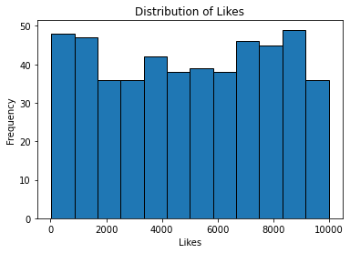

This visualization helps in understanding the spread and concentration of the 'Likes' values within the specified bins.

```python
# Calculate and print the mean of 'Likes'
print(f"Mean Likes: {SM['Likes'].mean()}")
```

    Mean Likes: 4995.168


```python
# Visualize 'Likes' per catergories and post types

sns.catplot(data=SM, x="Likes", y="Category", hue="Post Type", kind="swarm")
```


    <seaborn.axisgrid.FacetGrid at 0x7fd5f689cad0>


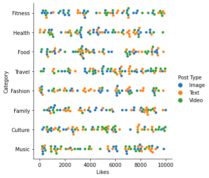

The 'swarm' plot kind represents individual data points in a categorical arrangement, where each point's position on the category axis reflects the 'Likes' value, segregated by both 'Category' and 'Post Type'. This visualization aids in understanding how 'Likes' are distributed within various categories and post types, allowing for a comparative analysis of their distribution patterns.

```python
sns.catplot(data=SM, x="Category", y="Likes", hue="Post Type", kind="bar")
```


    <seaborn.axisgrid.FacetGrid at 0x7fd5f6727650>


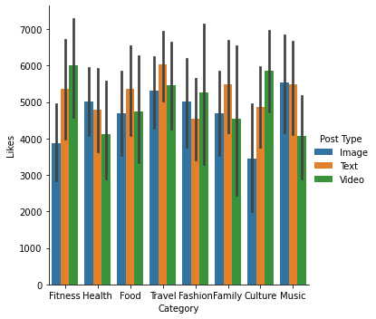


```python
As the previous catplot visualisation, This visualization also enables a comparative analysis of 'Likes' across various categories and post types, providing insight into their relative magnitudes within each category.
```


```python
sns.catplot(data=SM, x="Gender", y="Likes", hue="Post Type", kind="bar")
plt.title("Likes by Gender and Post Type")
```


    Text(0.5, 1.0, 'Likes by Gender and Post Type')


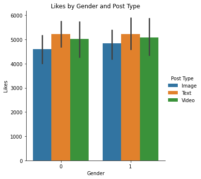


```python
# Group by 'Post Type' and calculate the mean of 'Likes'and 
mean_likes_type= SM.groupby('Post Type')['Likes'].mean()
print("Mean Likes per Post Type:")
print(mean_likes_type)
```

    Mean Likes per Post Type:
    Post Type
    Image    4717.142857
    Text     5223.322034
    Video    5051.054054
    Name: Likes, dtype: float64


```python
# Create a boxplot for 'Category' vs 'Likes'
plt.figure(figsize=(10, 6))
sns.boxplot(x='Category', y='Likes', data=SM)
plt.show()
```


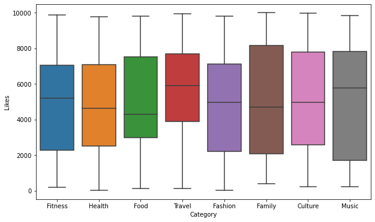


```python
# Group by 'Category' and calculate the mean of 'Likes'
mean_likes_category = SM.groupby('Category')['Likes'].mean()
print("Mean Likes per Category:")
print(mean_likes_category)
```

    Mean Likes per Category:
    Category
    Culture    4914.923077
    Family     4970.357143
    Fashion    4867.620690
    Fitness    4920.847458
    Food       4937.671875
    Health     4695.723077
    Music      4999.984615
    Travel     5601.323529
    Name: Likes, dtype: float64


```python
mean_G_category = SM.groupby('Category')['Gender'].mean()
print("Gender per Category:")
print(mean_G_category)
```

    Gender per Category:
    Category
    Culture    0.476923
    Family     0.517857
    Fashion    0.362069
    Fitness    0.491525
    Food       0.375000
    Health     0.538462
    Music      0.492308
    Travel     0.470588
    Name: Gender, dtype: float64


```python
# Visualize 'Engagement' & Post Types
sns.catplot(data=SM, x="Post Type", y="Engagement", kind="swarm")
```


    <seaborn.axisgrid.FacetGrid at 0x7fd5f4ddf190>


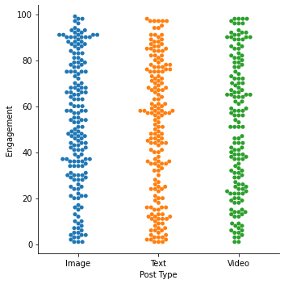


```python
#Analyzing the difference of likes for genders by categories
sns.catplot(data=SM, x="Category", y="Likes", hue="Gender", kind="box")
```


    <seaborn.axisgrid.FacetGrid at 0x7fd5f4dfea50>


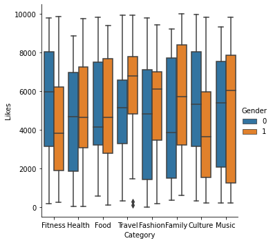


```python
# Create a boxplot for 'Post Type' vs 'Comments'
plt.figure(figsize=(8, 5))
sns.boxplot(x='Post Type', y='Comments', data=SM)
plt.title('Comments by Post Type')
plt.show()
```


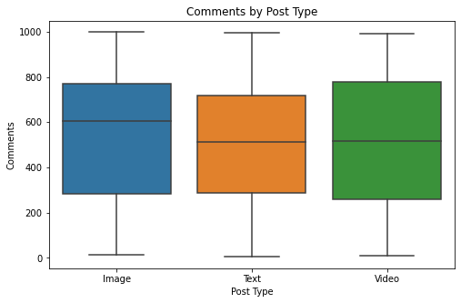


```python
# Visualize 'Age' with a histogram using Matplotlib
plt.hist(SM['Age'], bins=20, edgecolor='black')
plt.xlabel('Age')
plt.ylabel('Frequency')
plt.title('Distribution of Age')
plt.show()
```


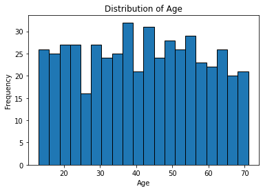


```python
# Create a boxplot for 'Gender' vs 'Likes'
plt.figure(figsize=(6, 4))
sns.boxplot(x='Gender', y='Likes', data=SM)
plt.title('Likes by Gender')
plt.show()
```


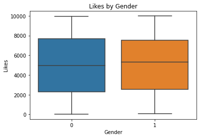


```python
# Group by 'Gendr' and calculate the mean of 'Likes'
mean_likes_category = SM.groupby('Gender')['Likes'].mean()
print("Mean Likes per Category:")
print(mean_likes_category)
```

    Mean Likes per Category:
    Gender
    0    4958.127341
    1    5037.613734
    Name: Likes, dtype: float64


```python
sns.catplot(data=SM, x="Category", y="Engagement", kind="bar")
print("Engagements per Category:")
```

    Engagements per Category:


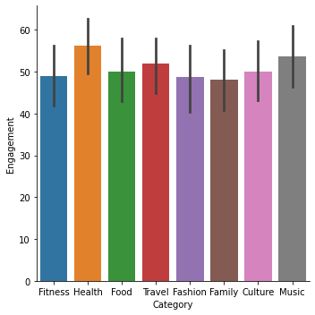


```python
sns.catplot(data=SM, x="Category", y="Engagement", hue="Post Type", kind="bar")
print("Engagements per Post Types in each Category:")
```

    Engagements per Post Types in each Category:


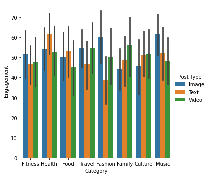


```python
sns.catplot(data=SM, x="Category", y="Engagement", hue="Gender", kind="bar")
```


    <seaborn.axisgrid.FacetGrid at 0x7fd5f4665490>


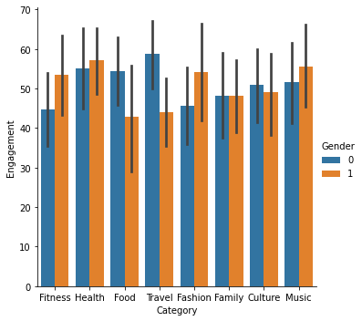

